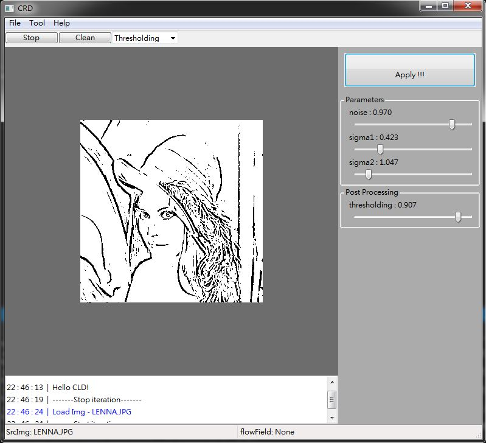
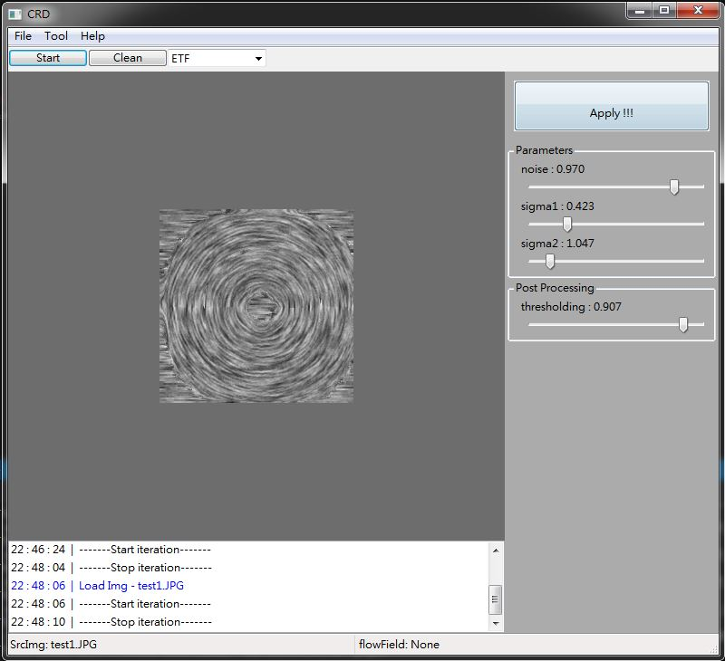

# Coherent-Line-Drawing

This is an implementation of 'Coherent Line Drawing' by Kang et al, Proc. NPAR 2007 .  
The project website for that paper is here: http://cg.postech.ac.kr/research/coherent_line/  
This is a GUI version of CLD.

### install required:
 - openCV 
 - wxwidget
 - cmake
 
### screenshot

