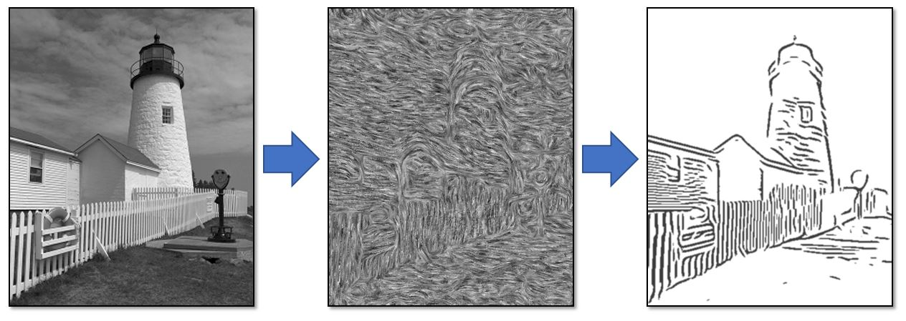
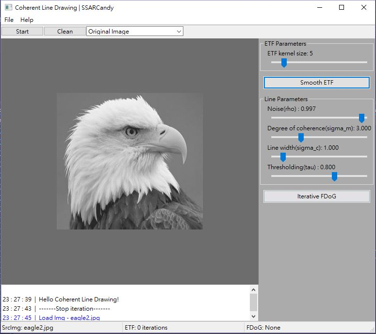
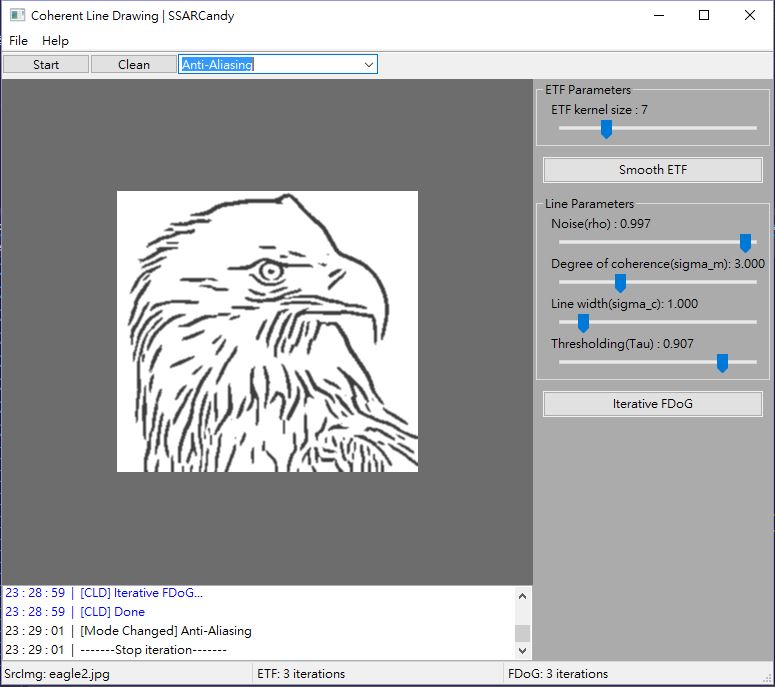

# Coherent Line Drawing

[](https://github.com/SSARCandy/Coherent-Line-Drawing/actions)
[](https://travis-ci.org/SSARCandy/Coherent-Line-Drawing)
[](https://codecov.io/gh/SSARCandy/Coherent-Line-Drawing)
[](https://github.com/SSARCandy/Coherent-Line-Drawing/blob/master/LICENSE)


This project implemented a non-photorealistic rendering technique presented by Kang et al, that can automatically generates a line drawing from a photograph. This project provide an easy-to-use, real-time interactive graphic user interface system.


- [Original academic paper](http://citeseerx.ist.psu.edu/viewdoc/download?doi=10.1.1.108.559&rep=rep1&type=pdf)
- [Introduction in Chinese](https://ssarcandy.tw/2017/06/26/Coherent-Line-Drawing/)



## Workflow (Youtube)

<a href="http://www.youtube.com/watch?feature=player_embedded&v=48fTXKUTM-8
" target="_blank"></a>


## Build

### Requirement

- C++ 17
- OpenCV 3
- WxWidget 3 (not required for cmd application)
- CMake

_If you prefer C++ 11 version, there is a branch called [cpp11](https://github.com/SSARCandy/Coherent-Line-Drawing/tree/cpp11), the function is equivalent._  

It should work fine in Windows/Linux/MacOS.  
I provided some scripts that can use in Linux:


```sh
# Usage: build.sh [options]
# Options:
#   -c, --clean       Clean build
#   -d, --debug       Build with debug mode
#   -j, --jobs        Use N cores to build
$ ./build.sh

# Usage: linter.sh [options]
# Check code style
# Options:
#   -i                In-place format
$ ./linter.sh
```

### Command Line Version

I provide another command line application that can directly use without graphic interface, the entry point is `src/cmd.cpp`. The options is list as following, also you can refer to `./test.sh` to see how to use:

```sh
# Coherent-Line-Drawing Options:
#   -h [ --help ]            Help message
#   -s [ --src ] arg         Source image path
#   -o [ --output ] arg      Output image path
#   --ETF_kernel arg (=5)    ETF kernel size
#   --ETF_iter arg (=1)      Refining n times ETF
#   --CLD_iter arg (=1)      Iterate n times FDoG
#   --sigma_c arg (=1)       Line width
#   --sigma_m arg (=3)       Degree of coherence
#   --rho arg (=0.997)       Noise
#   --tau arg (=0.8)         Thresholding
```

### Pre-Build GUI Version

You can download pre-build version at [here](https://github.com/SSARCandy/Coherent-Line-Drawing/releases).  
Including Windows and macOS versions.

**Screenshots**




